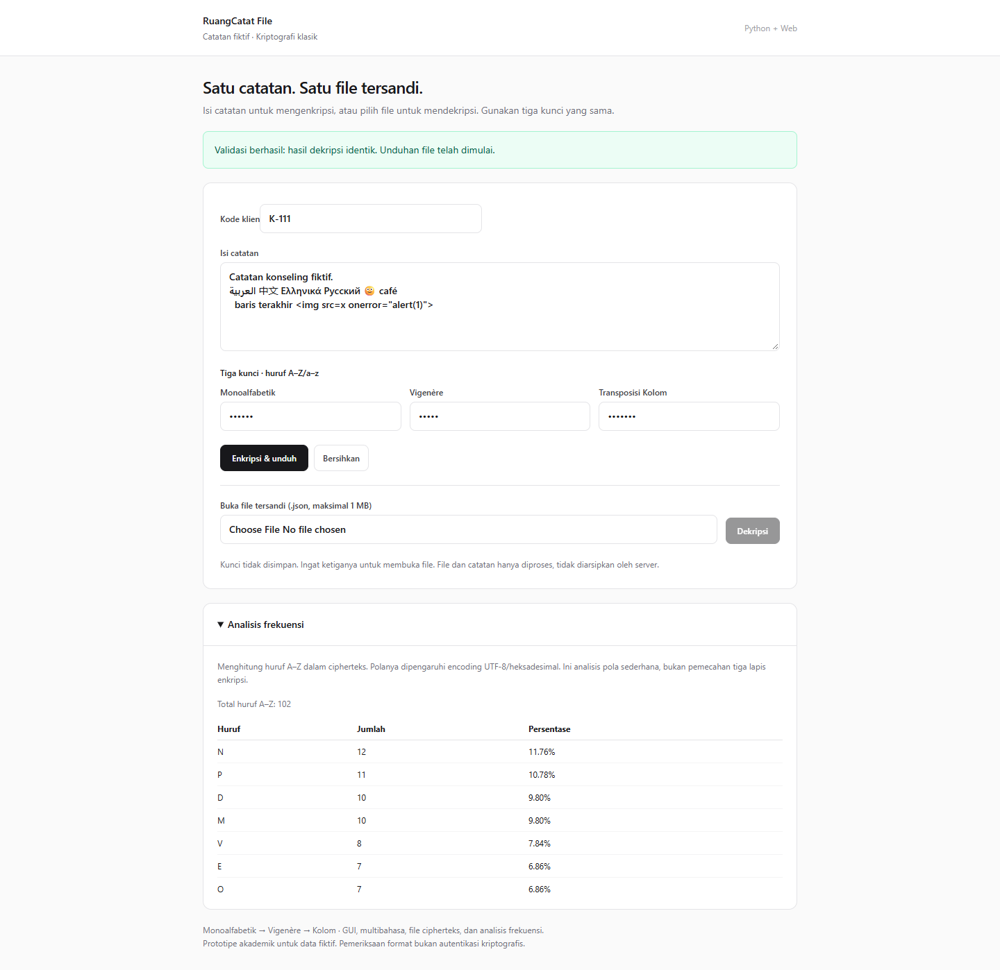
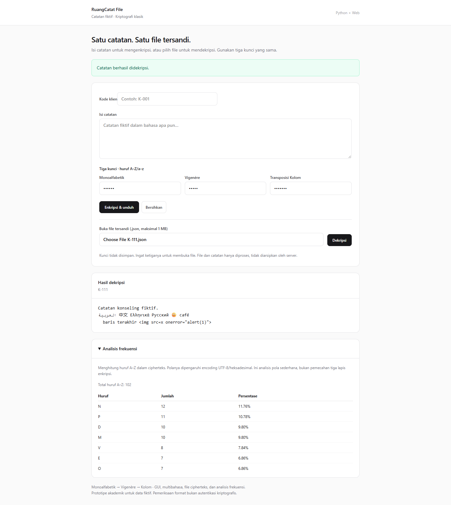
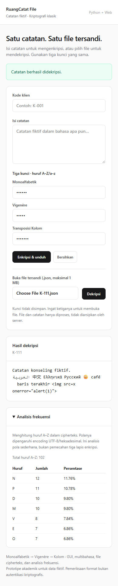

# LAPORAN TUGAS PROYEK KRIPTOGRAFI

## Halaman judul
**RuangCatat File: Web Lokal Catatan Konseling dengan Substitusi Monoalfabetik,
Vigenère, dan Transposisi Kolom**

Mata kuliah: Kriptografi (IF21A05)  
Kelas / dosen: [isi]  
Anggota / NIM: [isi, maksimal 5 anggota]  
Institusi / tahun: [isi]

## Deskripsi singkat program
RuangCatat File memproses catatan konseling fiktif menggunakan kode samaran.
Pengguna memasukkan catatan dan tiga kunci, mengenkripsinya, lalu mengunduh
file tersandi. File dapat dibuka kembali dengan kunci yang sama. Satu halaman
web menyediakan formulir, hasil dekripsi, serta analisis frekuensi yang dapat dilipat.

Algoritma ditulis sendiri dalam Python, tanpa library kriptografi. Server HTTP
pustaka standar Python melayani HTML, CSS Tailwind lokal dan JavaScript vanilla.
JavaScript hanya mengelola input, komunikasi HTTP, unggah/unduh dan tampilan.
Aplikasi tidak memakai database atau localStorage.

## Algoritma dan alur
### Substitusi Monoalfabetik
Hilangkan huruf kunci yang berulang, lalu tambahkan alfabet tersisa. Pemetaan
alfabet biasa ke alfabet kunci menghasilkan cipherteks. Dekripsi membalik pemetaan.

### Vigenère
Dengan A=0 hingga Z=25, enkripsi C=(P+K) mod 26 dan dekripsi P=(C-K) mod 26.
Kunci diulang untuk A–Z/a–z; karakter lain tidak menghabiskan posisi kunci.

### Transposisi Kolom
Teks disusun per baris selebar panjang kunci. Kolom dibaca menurut urutan huruf
kunci; huruf sama diurutkan menurut posisi asal. Dekripsi menghitung panjang
setiap kolom dari pembagian dan sisa panjang teks. Tidak menggunakan padding.

### Encoding untuk multibahasa
Kode dan isi dibungkus JSON berpenanda format. JSON diubah menjadi UTF-8 lalu
hex huruf besar sebelum masuk tiga algoritma. Sesudah dekripsi, hex diubah
menjadi byte UTF-8 lalu JSON. Encoding bukan algoritma kriptografi keempat.
Pendekatan ini memulihkan aksara non-Latin dan emoji tanpa tabel alfabet khusus.

### Alur enkripsi
Kode + isi + tiga kunci → validasi → JSON → UTF-8/hex → Monoalfabetik →
Vigenère → Kolom → dekripsi balik → bandingkan persis → file JSON tersandi.
Pesan “Validasi berhasil: hasil dekripsi identik” muncul setelah pemeriksaan.

### Alur dekripsi
Pilih file + tiga kunci → validasi file → balik Kolom → balik Vigenère →
balik Monoalfabetik → decode hex/UTF-8 → periksa penanda JSON → tampilkan kode/isi.
Salah kunci atau data rusak menampilkan kesalahan; file asli tidak berubah.
Bersihkan menghapus formulir, kunci, file pilihan, hasil dan frekuensi dari halaman.

### Analisis frekuensi
Hitung kemunculan A–Z pada cipherteks, abaikan angka/nonhuruf, lalu tampilkan
jumlah dan persentase dari total huruf. Tabel diurutkan menurut frekuensi.
Pola dipengaruhi encoding; analisis ini tidak mengklaim memecahkan tiga lapis.

### Modularitas dan format file
Modul crypto memisahkan tiga algoritma, pipeline, validasi kunci, dan frekuensi.
notes.py menangani encoding serta format; server.py menangani HTTP.
File berisi format ruangcatat-file-v2 dan ciphertext, tanpa kunci/plainteks.
Kode klien juga berada dalam isi terenkripsi. Ukuran file maksimal 1 MB.

## Screenshot dan penggunaan
Screenshot aktual menggunakan data fiktif, diambil pada server lokal.
Ganti/tambahkan hasil pelaksanaan kelompok sebelum pengumpulan akhir.

### Enkripsi dan analisis

Catatan dan kunci diproses Python, lalu browser mengunduh file tersandi.
Tabel frekuensi menampilkan jumlah/persentase setiap huruf.

### Dekripsi multibahasa

File diunggah kembali dan dipulihkan identik, termasuk aksara lain dan emoji.
Teks seperti markup ditampilkan sebagai teks biasa.

### Tampilan mobile

Input disusun satu kolom pada layar kecil, tanpa sidebar atau dialog tambahan.

## Pengujian
26 tes Python lulus pada 6 Oktober 2026. Tes mencakup vektor diketahui, invers
rangkaian, kunci berulang, kolom tidak penuh, Unicode, file/format, privasi,
batas ukuran, analisis frekuensi dan endpoint HTTP.
Pengujian browser Edge headless lulus untuk unduh–unggah–dekripsi, salah kunci,
file rusak/versi lama/terlalu besar, Bersihkan, server tak tersedia dan mobile.
Rincian ada pada HASIL_PENGUJIAN.md. [Tambahkan uji mandiri kelompok.]

## Kesesuaian penugasan
| Ketentuan | Implementasi |
|---|---|
| Minimal tiga algoritma, substitusi dan transposisi | Monoalfabetik, Vigenère, Kolom |
| Input plainteks | Textarea |
| Input kunci | Tiga input kata |
| Enkripsi/dekripsi | Enkripsi & unduh / Dekripsi |
| Validasi identik | Dekripsi balik dan perbandingan persis |
| Komentar dan tanpa library kriptografi | Modul Python buatan sendiri |
| GUI tambahan | Antarmuka web |
| Kriptanalisis tambahan | Frekuensi huruf |
| Multibahasa tambahan | Representasi UTF-8 dan pemulihan Unicode |
| Baca/tulis cipherteks tambahan | Pilih file JSON / unduh file JSON |

Keunikan kombinasi harus dipastikan di kelas. Persetujuan dosen atas bentuk
fitur tambahan masih diperlukan dalam penilaian aktual.

## Kesimpulan
Program menerapkan tiga algoritma klasik berurutan dan memulihkan catatan
multibahasa melalui encoding. Penyimpanan lewat file mengurangi kompleksitas
aplikasi, sedangkan GUI dan frekuensi mendukung demonstrasi.
Validasi pemulihan bukan pembuktian keamanan. Penanda format bukan autentikasi.
Program digunakan untuk data fiktif, bukan catatan konseling asli.
[Sesuaikan dengan evaluasi kelompok.]

## Pembagian tugas kelompok
Isi sesuai kontribusi sebenarnya. Usulan ini bukan klaim pekerjaan anggota.

| Anggota/NIM | Tanggung jawab | Kontribusi aktual |
|---|---|---|
| [1] | Monoalfabetik dan penjelasan | [isi] |
| [2] | Vigenère dan pipeline | [isi] |
| [3] | Kolom dan pengujian algoritma | [isi] |
| [4] | Format file, Unicode, analisis frekuensi | [isi] |
| [5] | Server, UI, uji browser dan laporan | [isi] |

## Referensi
- TUGAS PROYEK KRIPTOGRAFI.pdf.
- 4-Algoritma_Klasik1 (1).pdf; 5-Algoritma_Klasik2 (1).pdf;
  7-Algoritma_Klasik3 (1).pdf.
- https://tailwindcss.com/docs/installation/tailwind-cli
