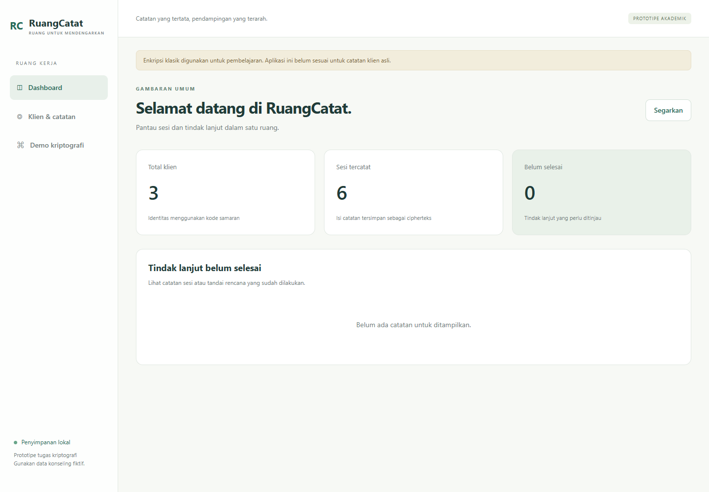
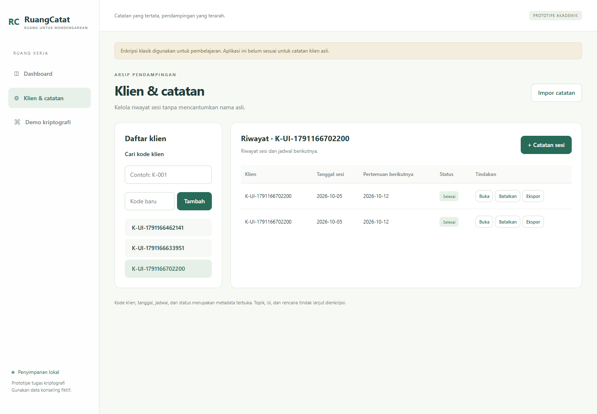
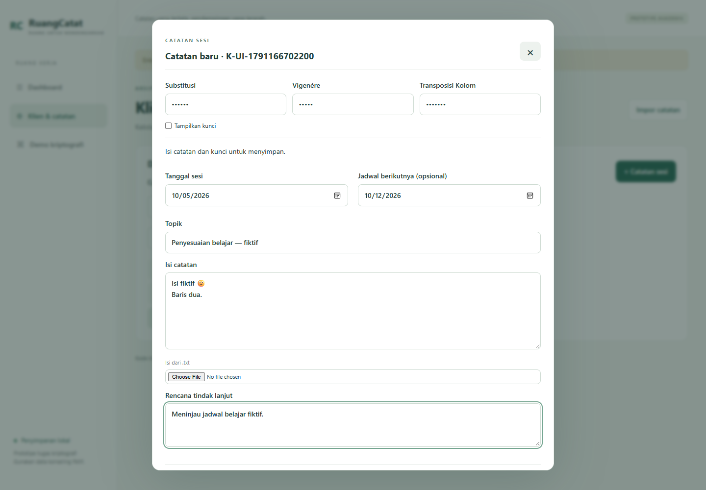
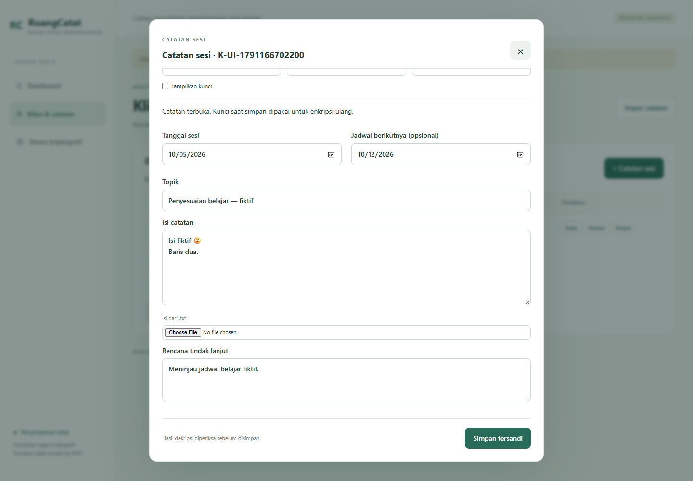
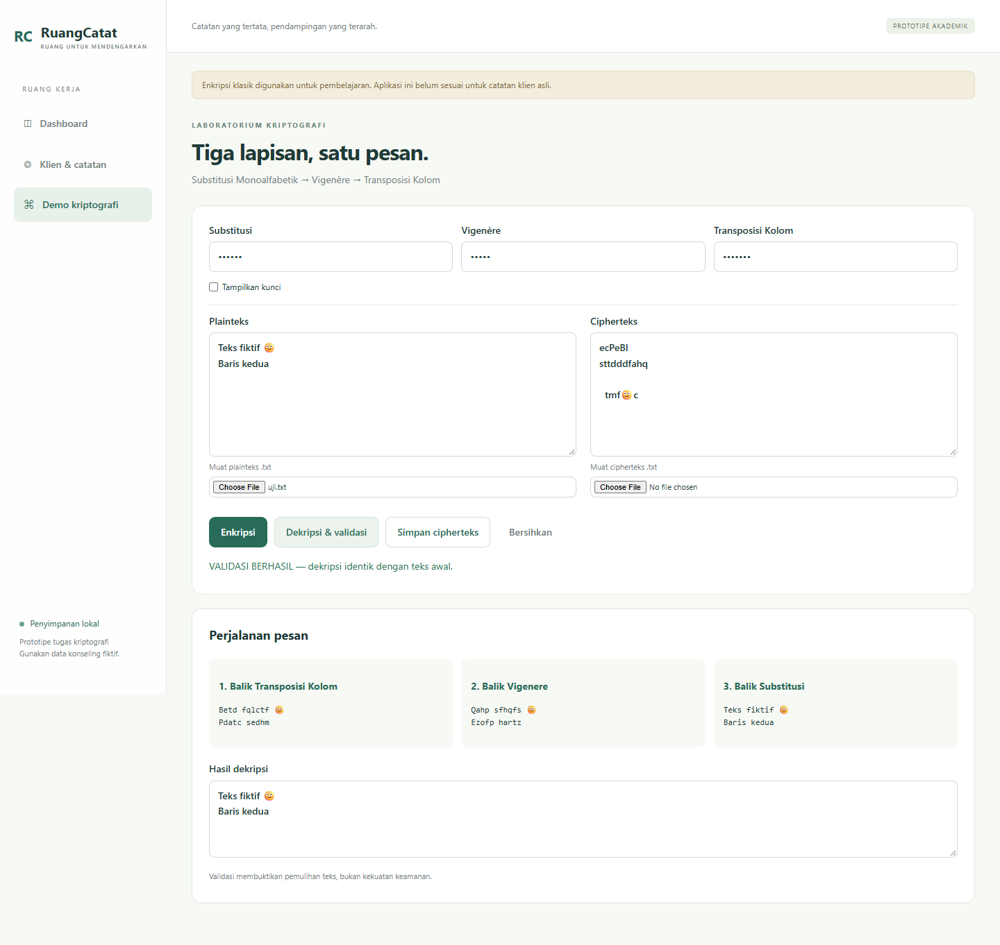
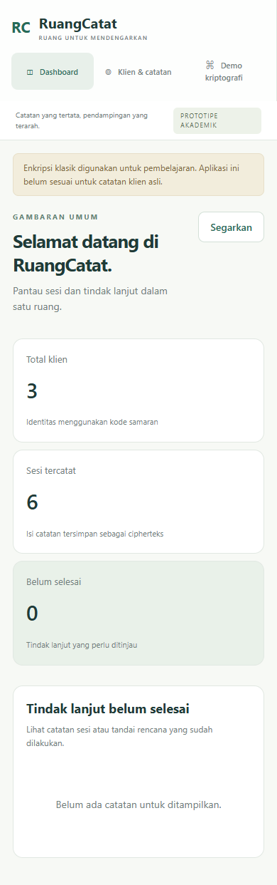

# LAPORAN TUGAS PROYEK KRIPTOGRAFI

## Halaman Judul

**Rancang Bangun Prototipe Aplikasi Catatan Konseling Menggunakan Enkripsi Berlapis Substitusi Monoalfabetik, Vigenere, dan Transposisi Kolom**

Mata kuliah: Kriptografi (IF21A05)  
Nama aplikasi: RuangCatat  
Kelas: [isi]  
Dosen: [isi]  
Kelompok/anggota dan NIM: [isi, maksimal 5 orang]  
Institusi dan tahun: [isi]

## Deskripsi Singkat Program

RuangCatat merupakan prototipe web lokal untuk mengelola catatan konseling fiktif berdasarkan kode klien samaran. Program menyediakan dashboard, riwayat sesi, catatan tersandi, status tindak lanjut, impor/ekspor, serta halaman demonstrasi algoritma. Dibangun menggunakan HTML/CSS/JavaScript, Python, dan SQLite tanpa paket kriptografi siap pakai.

Topik, isi catatan, dan rencana tindak lanjut diserialisasi sebagai JSON dan dienkripsi. Kode klien, tanggal sesi, jadwal berikutnya, dan status tidak dienkripsi. Kunci tidak disimpan. Produk tidak dimaksudkan untuk penggunaan data konseling asli karena algoritma klasik tidak memberikan keamanan modern.

## Algoritma dan Alur Program

### Substitusi Monoalfabetik

Huruf berulang pada kata kunci dihapus, lalu sisa huruf alfabet ditambahkan sehingga terbentuk permutasi 26 huruf. Huruf plainteks diganti melalui pemetaan; dekripsi memakai pemetaan invers. Huruf besar/kecil dipertahankan.

### Vigenere

A=0 sampai Z=25. Untuk posisi huruf i, enkripsi `C_i=(P_i+K_i) mod 26`, dekripsi `P_i=(C_i-K_i) mod 26`. Kunci diulang. Karakter selain A-Z/a-z tetap dan tidak menghabiskan posisi kunci.

### Transposisi Kolom

Teks disusun secara konseptual baris demi baris dengan lebar sebesar panjang kata kunci. Kolom dibaca berdasarkan urutan alfabet kunci; huruf kunci berulang diurutkan berdasarkan indeks asal. Dekripsi menghitung panjang setiap kolom dari hasil pembagian panjang teks dengan lebar, kemudian menyusun karakter menurut posisi aslinya. Tidak ada padding.

### Enkripsi dan penyimpanan

Input catatan → validasi formulir/kunci → serialisasi JSON → substitusi monoalfabetik → Vigenere → transposisi kolom → dekripsi uji → bandingkan identik → simpan cipherteks dan metadata dalam SQLite.

### Pembukaan dan pembaruan

Pilih sesi → masukkan kunci → balik transposisi → balik Vigenere → balik substitusi → validasi struktur JSON → tampilkan isi. Jika hasil tidak valid, editor tetap terkunci dan arsip tidak ditimpa. Sesudah membuka, pengguna dapat mengedit dan menyimpan dengan kunci yang sedang dimasukkan.

### Impor/ekspor

Ekspor menghasilkan paket JSON berisi versi format, urutan algoritma, kode klien, tanggal, status, dan cipherteks. Impor memeriksa format, tanggal, kode, dan hasil dekripsi sebelum transaksi SQLite. Setiap impor membuat sesi baru; klien dengan kode yang sama digunakan kembali.

### Arsitektur modular

Antarmuka web menangani interaksi; API HTTP lokal menghubungkan browser ke service. Versi desktop tetap tersedia sebagai alternatif. Service menangani validasi dan enkripsi catatan. Repository menangani SQLite. Modul crypto hanya berisi algoritma serta pipeline, sehingga dapat diuji tanpa GUI/database.

## Screenshot dan Penjelasan

Screenshot berikut diambil dari aplikasi web yang berjalan, menggunakan database uji dan data fiktif:

### Dashboard

### Daftar klien dan riwayat sesi

### Formulir sesi baru

### Catatan setelah dibuka

### Demo dekripsi dan validasi identik

### Tampilan mobile

## Pengujian

Jalankan `python -m unittest discover -s tests -v`. Hasil pengujian otomatis: 27 tes lulus pada Windows, 5 Oktober 2026, menggunakan Python bawaan Codex. Uji browser Edge juga lulus. Rincian ada di HASIL_PENGUJIAN.md; kelompok perlu menambahkan hasil pengujian mandiri.

| Kelompok uji | Tujuan | Hasil aktual |
|---|---|---|
| Vektor diketahui tiap algoritma | Memastikan implementasi sesuai perhitungan referensi | Lulus |
| Round-trip Unicode/format/kosong/panjang | Memastikan dekripsi identik | Lulus |
| Kunci berulang dan kolom tak penuh | Memastikan invers transposisi benar | Lulus |
| Simpan/buka/edit/status dan persistensi | Memastikan alur arsip berjalan | Lulus |
| Salah kunci dan file rusak | Memastikan kegagalan tidak menimpa arsip | Lulus |
| Ekspor/impor dan privasi penyimpanan | Memastikan paket dapat dipulihkan tanpa menyimpan kunci/plainteks | Lulus |
| GUI | Memastikan interaksi utama berjalan | Lulus |

Validasi pemulihan bukan pembuktian keamanan. Validasi struktur JSON hanya menolak hasil yang tidak sesuai format dan tidak menjamin deteksi semua manipulasi.

## Kesimpulan

Prototipe menerapkan tiga algoritma klasik secara berlapis, mencakup substitusi dan transposisi, dengan enkripsi/dekripsi serta validasi identik. Konteks produk berupa pengarsipan catatan konseling fiktif. Penggunaan nyata memerlukan kriptografi modern dan pengelolaan akses yang memadai. [Sesuaikan kesimpulan dengan hasil pengujian kelompok.]

## Pembagian Tugas Kelompok

Tabel berikut usulan pembagian, bukan klaim pekerjaan anggota. Isi sesuai kontribusi sebenarnya; gabungkan tanggung jawab jika anggota kurang dari lima.

| Anggota/NIM | Tanggung jawab | Kontribusi aktual |
|---|---|---|
| [Anggota 1] | Substitusi Monoalfabetik dan dokumentasi | [isi] |
| [Anggota 2] | Vigenere dan pipeline | [isi] |
| [Anggota 3] | Transposisi Kolom dan pengujian crypto | [isi] |
| [Anggota 4] | SQLite, service, impor/ekspor | [isi] |
| [Anggota 5] | GUI, pengujian penggunaan, laporan | [isi] |

## Referensi

- Petunjuk tugas: TUGAS PROYEK KRIPTOGRAFI.pdf.
- Materi kuliah: 4-Algoritma_Klasik1 (1).pdf; 5-Algoritma_Klasik2 (1).pdf; 7-Algoritma_Klasik3 (1).pdf.
