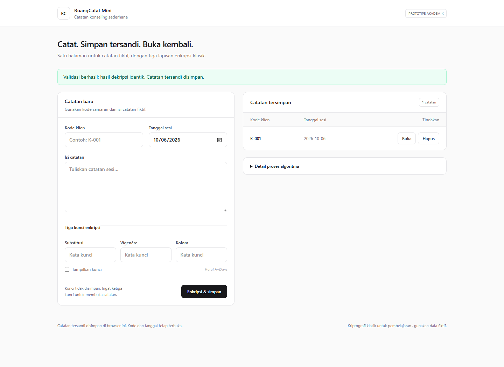
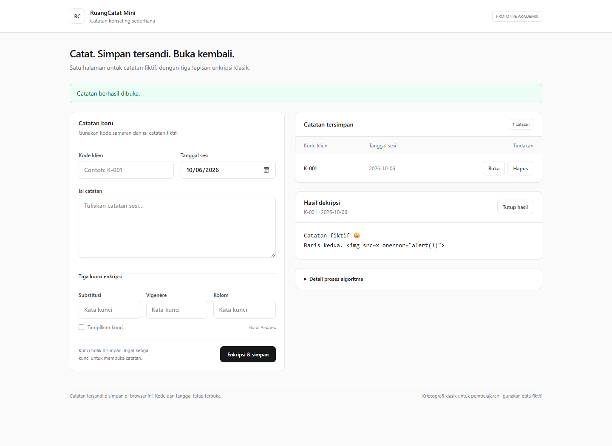
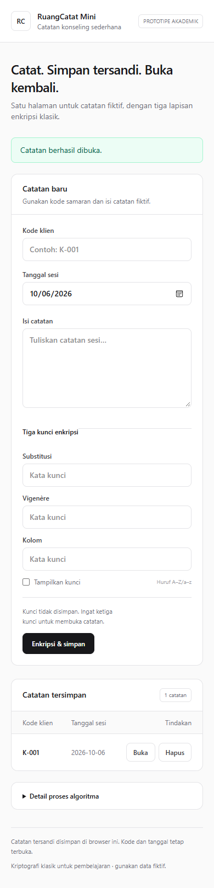

# LAPORAN TUGAS PROYEK KRIPTOGRAFI

## Halaman judul
**RuangCatat Mini: Prototipe Web Catatan Konseling dengan Substitusi Monoalfabetik,
Vigenère, dan Transposisi Kolom**

Mata kuliah: Kriptografi (IF21A05)  
Kelas / dosen: [isi]  
Anggota dan NIM: [isi, maksimal 5 anggota]  
Institusi / tahun: [isi]

## Deskripsi program
RuangCatat Mini adalah satu halaman web lokal untuk menyimpan catatan konseling
fiktif dengan kode klien samaran. Pengguna mengisi kode, tanggal dan isi catatan,
memasukkan tiga kunci, lalu mengenkripsi dan menyimpan. Catatan dapat dibuka
dengan kunci yang sama atau dihapus setelah konfirmasi.

Teknologi: HTML, JavaScript vanilla, Tailwind CSS lokal, localStorage. Aplikasi
dijalankan melalui VS Code Live Server. Tidak memiliki backend atau database
aktif. Fungsi kriptografi ditulis sendiri, tanpa paket kriptografi.

## Algoritma dan modularitas
### Substitusi Monoalfabetik
Kata kunci dinormalisasi menjadi huruf besar. Huruf duplikat dihapus kemudian
alfabet yang belum muncul ditambahkan. Pemetaan alfabet biasa ke alfabet kunci
dipakai untuk enkripsi, pemetaan invers untuk dekripsi. Besar/kecil dipertahankan.

### Vigenère
A=0 hingga Z=25. Enkripsi C=(P+K) mod 26; dekripsi P=(C-K+26) mod 26.
Kunci diulang hanya untuk huruf A–Z/a–z. Karakter lain tetap di posisinya dan
tidak menghabiskan posisi kunci.

### Transposisi Kolom
Teks ditulis secara konseptual per baris selebar kata kunci. Kolom dibaca
menurut huruf kunci yang diurutkan alfabetis, dengan indeks asal sebagai pembeda
untuk huruf yang sama. Untuk dekripsi, panjang kolom dihitung dari pembagian
jumlah karakter dengan lebar; kolom kiri memperoleh sisa karakter. Karakter
disusun kembali per baris. Tanpa padding; emoji diperlakukan sebagai code point.

Setiap algoritma mempunyai encrypt(text,key) dan decrypt(text,key) pada berkas
terpisah. pipeline.js merangkai algoritma serta menyertakan hasil setiap tahap.
app.js menangani alur; ui.js merender tampilan; storage.js menangani penyimpanan.

## Alur program
Enkripsi:
input → validasi → JSON berpenanda format → Monoalfabetik → Vigenère → Kolom →
dekripsi balik dan perbandingan identik → simpan cipherteks beserta metadata.

Pembukaan:
pilih catatan → isi kembali tiga kunci → balik Kolom → balik Vigenère →
balik Monoalfabetik → validasi format JSON → tampilkan catatan.
Format salah menghasilkan pesan “Kunci salah atau data rusak”.
Penghapusan:
pilih Hapus → konfirmasi → hapus record → perbarui daftar. Batal tidak mengubah data.

localStorage menyimpan versi, ID, kode klien, tanggal, waktu penambahan, cipherteks.
Kunci dan plainteks tidak disimpan. Metadata tetap terbuka. Pemeriksaan format
bukan jaminan autentikasi, dan enkripsi klasik tidak cocok untuk data konseling asli.

## Screenshot dan penjelasan
Screenshot diambil dari aplikasi yang berjalan di localhost dengan data fiktif.
Ganti atau tambahkan screenshot hasil pelaksanaan kelompok jika diperlukan.

### Formulir dan catatan tersimpan

Pesan validasi muncul setelah dekripsi identik dan penulisan berhasil.
Formulir serta kunci dibersihkan; daftar berisi metadata dan tombol tindakan.

### Hasil dekripsi

Isi yang dibuka dipulihkan persis termasuk Unicode dan baris baru.
Teks mirip markup ditampilkan sebagai teks biasa.

### Tampilan perangkat kecil

Formulir disusun satu kolom, dengan tabel sederhana di bawahnya.

## Pengujian
Pada 6 Oktober 2026, 21 tes Node.js lulus dan uji browser Edge headless lulus.
Pengujian mencakup vektor diketahui, invers rangkaian, kunci berulang, kolom tidak
penuh, Unicode, kasus kosong/panjang, format storage, persistensi, privasi,
gagal simpan, salah kunci, hapus/batal, dan data rusak.
Rincian serta batas pemeriksaan tersedia dalam HASIL_PENGUJIAN.md.
[Tambahkan hasil pengujian mandiri kelompok.]

## Kesimpulan
Prototipe memenuhi input plainteks, input kunci, enkripsi, dekripsi dan validasi
kesamaan teks menggunakan tiga algoritma klasik. Pemisahan modul memudahkan
penjelasan dan pengujian setiap algoritma. Penyimpanan lokal mendukung pembukaan
ulang setelah refresh. Algoritma ini untuk pembelajaran dengan data fiktif.
[Sesuaikan dengan evaluasi kelompok.]

## Pembagian tugas
Usulan berikut harus diisi berdasarkan kontribusi sebenarnya.

| Anggota/NIM | Tanggung jawab | Kontribusi aktual |
|---|---|---|
| [1] | Substitusi Monoalfabetik dan penjelasan | [isi] |
| [2] | Vigenère dan pipeline | [isi] |
| [3] | Transposisi Kolom dan pengujian algoritma | [isi] |
| [4] | localStorage dan pengujian penyimpanan | [isi] |
| [5] | Antarmuka, uji browser dan laporan | [isi] |

## Kesesuaian penugasan
| Ketentuan | Implementasi |
|---|---|
| Minimal 3 algoritma, substitusi dan transposisi | Monoalfabetik, Vigenère, Kolom |
| Input plainteks langsung atau file | Textarea input langsung |
| Input kunci | Tiga input dengan tampilkan/sembunyikan |
| Enkripsi dan dekripsi | Simpan dan Buka |
| Validasi identik | Perbandingan string sebelum penyimpanan |
| Komentar dan tanpa paket kriptografi | Modul logika JavaScript buatan sendiri |
| Struktur laporan dan kontribusi | Bagian laporan dan tabel anggota |

Pastikan keunikan kombinasi algoritma di kelas sebelum pengumpulan.
Fitur file, kriptanalisis dan lainnya dalam penugasan bersifat tambahan.

## Referensi
- TUGAS PROYEK KRIPTOGRAFI.pdf.
- 4-Algoritma_Klasik1 (1).pdf; 5-Algoritma_Klasik2 (1).pdf;
  7-Algoritma_Klasik3 (1).pdf.
- Dokumentasi Tailwind CLI: https://tailwindcss.com/docs/installation/tailwind-cli
